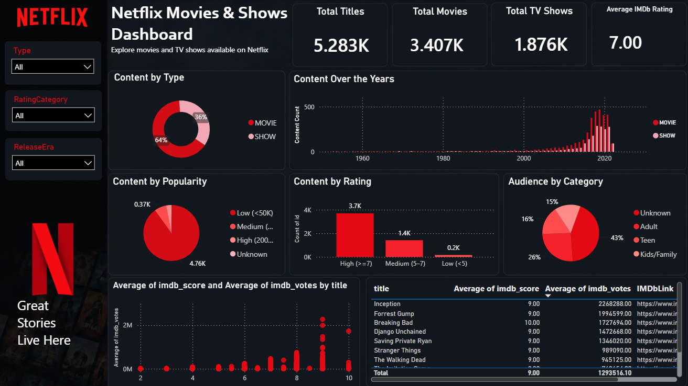

  

  
### An Interactive Netflix Content Analytics Dashboard

**Microsoft Power BI • DAX • Data Visualization • Business Intelligence**

---

## 📌 Project Overview

This project analyzes Netflix Movies and TV Shows data using **Microsoft Power BI** to transform raw content data into meaningful visual insights.

The dashboard provides an interactive view of Netflix's content library and helps explore patterns across **content types, genres, ratings, release years, popularity, and audience categories**.

---

## 🎯 Objectives

- Analyze the distribution of Movies and TV Shows on Netflix.
- Identify popular genres and content categories.
- Analyze content trends across release years.
- Understand the distribution of IMDb ratings.
- Analyze relationships between ratings, votes, and content attributes.
- Compare Movies and TV Shows using key performance metrics.

---

## 🛠️ Tools & Technologies

| Tool | Purpose |
|------|---------|
| **Microsoft Power BI** | Dashboard development & visualization |
| **DAX** | Calculations and analytical measures |
| **Power Query** | Data transformation and preparation |
| **Microsoft Excel** | Dataset and source data |
| **Data Visualization** | Interactive charts and KPI analysis |

---

## 📊 Key Analysis

The dashboard focuses on the following analytical areas:

- **Content Distribution** – Movies vs TV Shows
- **Content Over the Years** – Release trends over time
- **Content by Popularity** – IMDb vote-based popularity categories
- **Content by Rating** – Distribution across rating categories
- **Audience Analysis** – Adult, Teen, Kids/Family and Unknown categories
- **IMDb Analysis** – IMDb scores and vote patterns
- **Title-Level Analysis** – Individual title performance

---

## 📈 Dashboard

### 🔴 Netflix Movies & Shows Dashboard

---

## 🔍 Key Insights

The analysis helps understand:

- Distribution of Movies and TV Shows in the Netflix dataset.
- Most common genres and content categories.
- Changes in Netflix content releases over time.
- Distribution of IMDb ratings across content.
- Relationship between ratings, votes, and other content attributes.
- Differences between Movies and TV Shows based on key metrics.

---

## 📁 Project Files

- **`Netflix_DASHBOARD.pbix`** – Power BI dashboard file
- **`Netflix TV Shows and Movies (2).xlsx`** – Dataset used for analysis
- **`Netflix_Project_Dashboard.png`** – Dashboard preview
- **`Netflix_Movies_Shows_PowerBI_Project_Presentation.pptx`** – Project presentation
- **`netflix_dashboard_compressed.mp4`** – Dashboard walkthrough recording

---

## 💡 Skills Demonstrated

- Data Cleaning & Preparation
- Data Transformation
- Exploratory Data Analysis
- DAX Measures
- Data Visualization
- Interactive Dashboard Development
- KPI Analysis
- Business Insights
- Power BI

---

## 📌 Conclusion

This project demonstrates practical **Power BI data analytics skills**, including data preparation, transformation, DAX-based analysis, data visualization, and interactive dashboard development.

It showcases how raw Netflix content data can be transformed into an interactive analytical dashboard for exploring **content trends, audience categories, ratings, popularity, and meaningful business insights**.

  

---

### 🔴 Built with Microsoft Power BI

**Netflix Movies & TV Shows Analysis**

